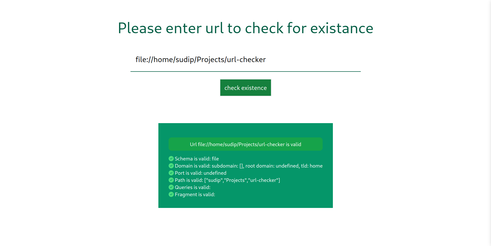
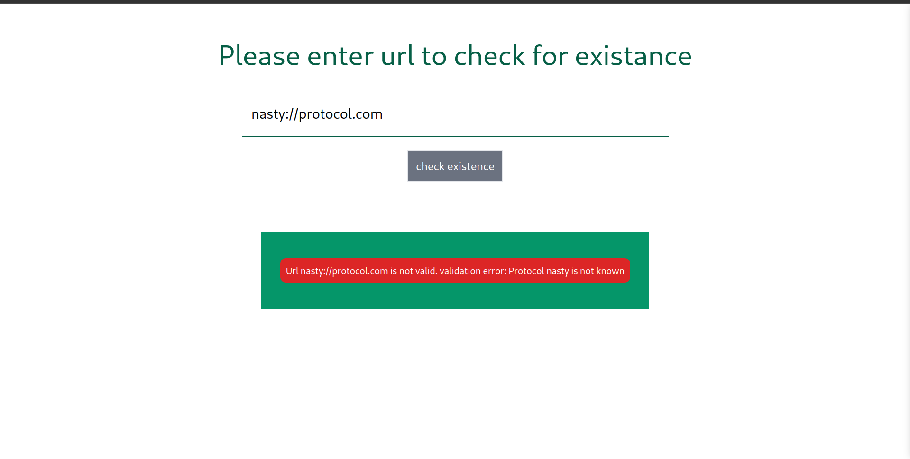
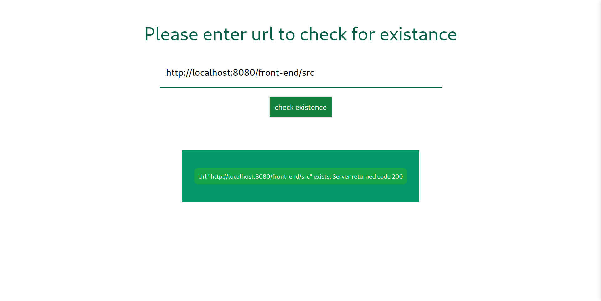

# Url existance checker
Check for url sementic and it's existance

[Goto Screenshots](#screenshots)

# How to run
Below command will copile the tailwind, compile the typescript, start a http-server and open the link for you.
For reference, please refer to package.json file
```sh
npm install
npm run demo
```

## Navigation
Whole logic can be navigated in following steps:
1) Register event listener to reach to every change in input value
2) Check if this input value have valid url format
3) if so wait for x milliseconds to allow for throttle. So we dont call server for every keystroke. Wait for user pause
4) Call the server ( mocked in current impl ) to check if url exists and is file/folder.
5) See if url input have been changed, if so do nothing since this server response is for old input value. Else,
update the ui to show result

### Url validation can be broken down to:
1) seperate anything before :// and check if it is known url
2) seperate until next '/' or end to get the domains and port info
3) seperate domain_ports string by : to get domain and port
4) seperate domain by . to get sub-domaind, tld, and root domain
4) From step 3, rest of the string is treated as slug, query and fragment
5) seperate from lat # to get fragment if any
6) seperate by ? to seperate paths and queries ( if any )
7) seperate path by / to get individual path and check if all path have valid character
8) if all passes, return schema ( step 1), port ( step 3), (sub/root)domains ( step 4), path ( step 7 ), queries ( step 6), fragment ( step 5 )
9) if error occurs at any point in above steps, early return with error information

## Caviates
I assume main intent of this assignment is to see how I perform and thing through purpose.
There are many things assumed to be (not) true for simplicity purpose. If you would like to discuss anything in specific in further more details, I am open to take questions.

# Screenshots


